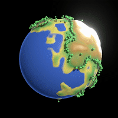

# Stylized Planet Generator

This is a stylized procedural planet generator written in Godot 3.0. It creates oceans, lakes, icy mountains, forests, etc.

[Here's a video of it in action.](https://www.youtube.com/watch?v=l7gIm8AVG_c)

# How it works
The algorithm is based on some article I found many years ago, unfortunately I lost the link to it. If anyone knows where it is, let me know. The idea is as follows:

1. Start with an icosphere.
2. Pick a random vector on the unit sphere and call it `v`.
3. For every vertex `p` in the icosphere: if the dot product between `v` and `p` is positive, move `p` a little away from the origin. Else, move it a little towards the origin.
4. Repeat 2 and 3 a few hundred times.

After that, trees are planted. A probablity distribution is generated over the entire set of vertices, where the probability of placing a tree depends on the elevation of a vertex. A vertex below sea level has probablity 0, so no trees are placed below sea level, and the probablility increases when reaching "average" elevation, and then slowly drops off to zero again in the icy mountain range.

# License
MIT
